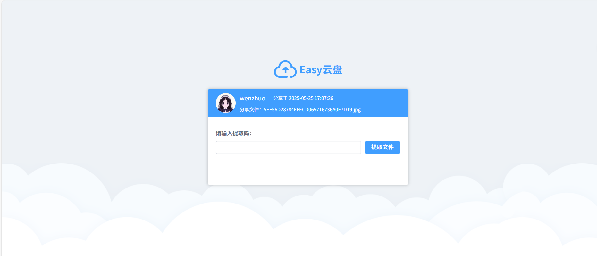

# wz云盘
## 功能描述
- 1，秒传、分片上传；缩略图、视频切面预览
- 2，外部分享
- 3，管理员、用户端权限管理
- 4，头像、昵称、密码等信息修改
- 5，回收回收站
- 6，qq-oatuh2.0授权登录

### 功能展示

[在线地址](http://154.64.245.158) 

## 部署
[部署文件](https://github.com/wenzhuo4657/CloudDisks/tree/master/docs/deploy.md)

